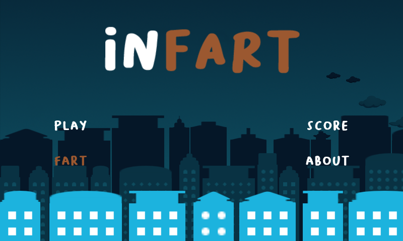
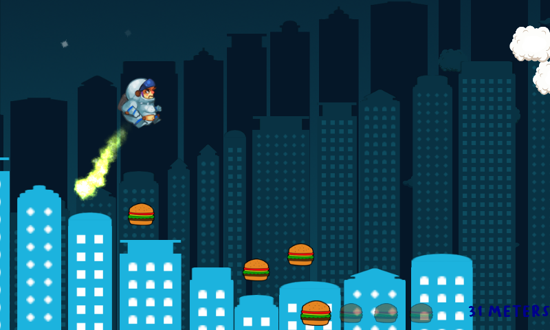
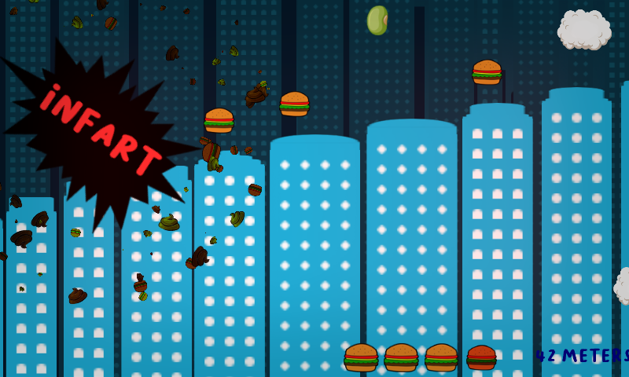
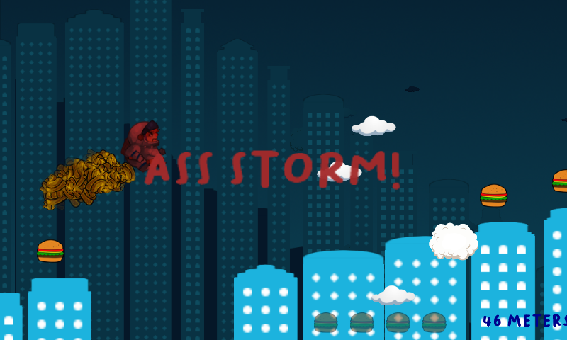

#  INFART

**TODO: Link to play**

The ozone hole has widened due to farts. There is no more atmosphere on earth!

Set in an abstract city, constantly changing, INFART is a very simple RUN AND FART game, where you have to eat vegetables, avoid hamburgers and holes. 

Features:
- A complete level with increasing difficulty
- A lot of farts
- Original soundtrack
- Handmade graphic

# Screenshots

---

The game is entirely **free** and open source: I didn't use any third party library to track or log user events. There are no ads too.

There are two versions:
- The CSharp version, that you can find in the `CSharp` folder
  - I coded this version (Android, Windows...) with these libraries:
    - [MonoGame](https://github.com/MonoGame)
    - [FbonizziMonoGame](https://github.com/FrancescoBonizzi/FbonizziMonoGame)
- The Web version, that you can play **HERE (TODO)**
  - I coded this version with [PixiJS](https://pixijs.com). **I will only support this**

---

If you like my work, please consider to [offer me an espresso!](https://www.paypal.com/cgi-bin/webscr?cmd=_donations&business=DTT7P8N3TV7N6&currency_code=EUR&source=url) ;-)
